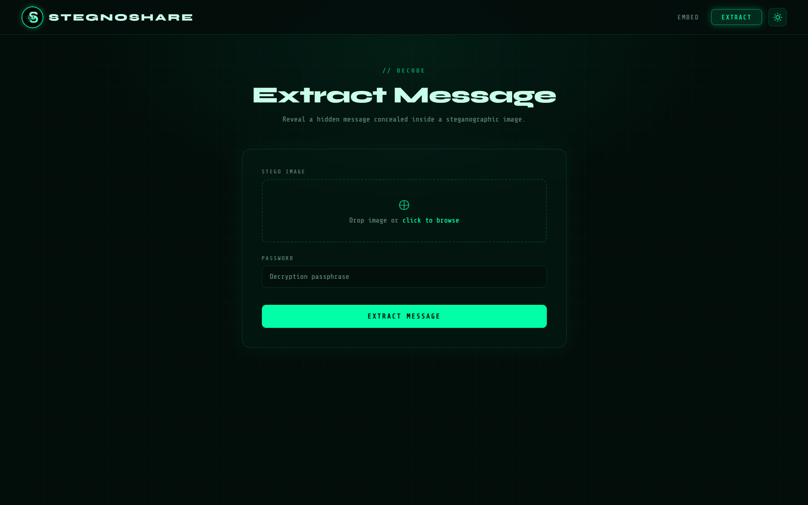
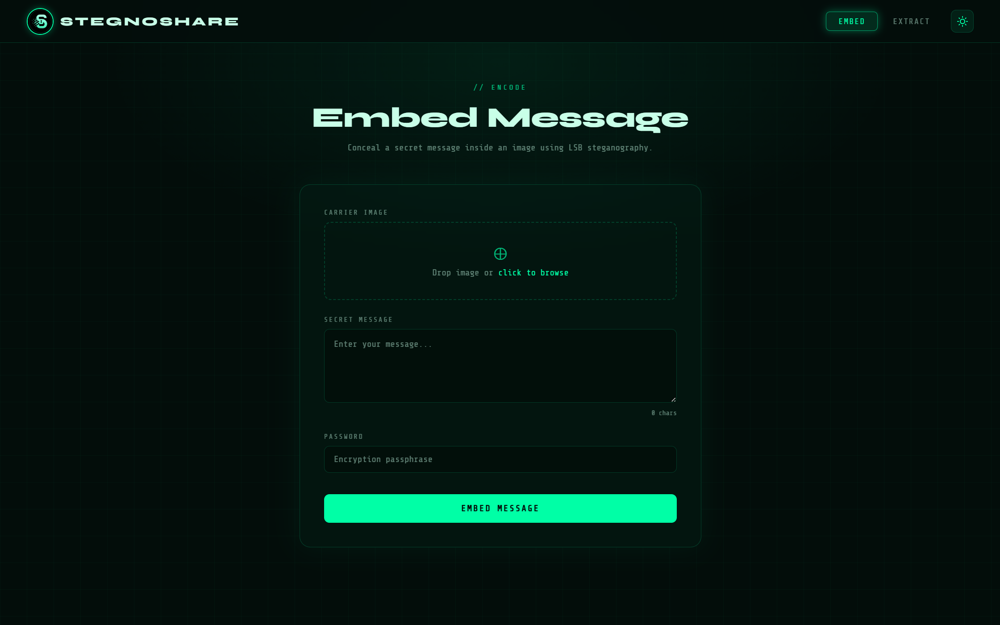
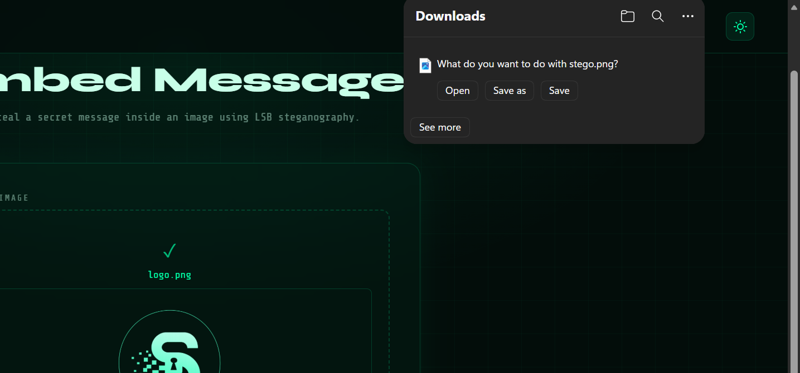

# StegnoShare

Secure AES-encrypted image steganography web application built with React and FastAPI.

## Overview

StegnoShare is an open-source web application that enables users to securely hide and retrieve confidential text messages inside images. The project combines modern cryptography with image steganography to provide a secure and user-friendly method of covert communication.

The application uses AES encryption to protect message confidentiality and Least Significant Bit (LSB) steganography to conceal encrypted payloads within lossless image formats such as PNG and BMP.

Built using React for the frontend and FastAPI for the backend, StegnoShare demonstrates practical implementation of secure communication techniques in a modern web environment.

---

## Features

- AES-based message encryption
- Password-protected hidden messages
- LSB image steganography
- Secure key derivation with random salt
- Integrity and authentication verification
- React-based frontend UI
- FastAPI backend services
- Drag-and-drop image upload support
- Downloadable stego-images
- Error handling for invalid passwords or corrupted images

---

## Tech Stack

### Frontend

- React
- Plain CSS
- JavaScript

### Backend

- Python
- FastAPI
- Pillow (PIL)

### Security & Processing

- AES Encryption
- LSB Steganography
- Secure Key Derivation Function (KDF)

---

## Folder Structure

```text
StegnoShare/
├─ backend/
│  └─ app/
│     ├─ crypto/
│     │  ├─ decrypt.py
│     │  ├─ encrypt.py
│     │  └─ key_derivation.py
│     ├─ stagno/
│     │  └─ stag.py
│     ├─ main.py
│     └─ requirements.txt
├─ frontend/
│  ├─ public/
│  │  ├─ logo.png
│  ├─ src/
│  │  ├─ components/
│  │  │  ├─ Embed.jsx
│  │  │  ├─ Extract.jsx
│  │  │  ├─ Layout.jsx
│  │  │  └─ Navbar.jsx
│  │  ├─ App.css
│  │  ├─ App.jsx
│  │  ├─ index.css
│  │  └─ main.jsx
│  ├─ index.html
│  └─ package.json
├─ screenshots/
├─ LICENSE
└─ README.md
```

---

## Installation

### Prerequisites

Make sure the following are installed:

- Git
- Node.js (v18 or later recommended)
- Python 3.10+
- pip

---

## Clone the Repository

```bash
git clone https://github.com/gurleen-singh-dev/StegnoShare.git
cd StegnoShare
```

---

## Frontend Setup

```bash
cd frontend
npm install
npm run dev
```

Frontend will start on:

```text
http://localhost:5173
```

---

## Backend Setup

Open another terminal:

### 1. Navigate to Backend Directory

```bash
cd backend/app
```

---

### 2. Create a Virtual Environment

#### Windows

```bash
python -m venv venv
```

#### macOS / Linux

```bash
python3 -m venv venv
```

---

### 3. Activate the Virtual Environment

#### Windows (PowerShell)

```bash
venv\Scripts\activate
```

#### Windows (Command Prompt)

```bash
venv\Scripts\activate.bat
```

#### macOS / Linux

```bash
source venv/bin/activate
```

---

### 4. Install Dependencies

```bash
pip install -r requirements.txt
```

---

### 5. Start the FastAPI Server

```bash
uvicorn main:app --reload
```

Backend will start on:

```text
http://127.0.0.1:8000
```
---

## API Endpoints

### Embed Secret Message

```http
POST /
```

#### Request Body

- Image file
- Plaintext message
- Password

#### Response

- Stego-image file

---

### Extract Secret Message

```http
POST /extract
```

#### Request Body

- Stego-image file
- Password

#### Response

- Original plaintext message

---

## Security Notes

- Only lossless image formats such as PNG and BMP should be used.
- JPEG images are not recommended because lossy compression can corrupt hidden data.
- Passwords are never stored by the application.
- A random salt is generated for every encryption operation.
- Integrity verification helps detect tampered or corrupted payloads.
- Hidden messages are encrypted before steganographic embedding.

---

## Screenshots

### Embed Page


### Extract Page


### Download stego-image



---

## Future Improvements

- Support for hiding files and documents
- User authentication system
- Image capacity estimation tool
- Mobile responsive optimization

---

## Disclaimer

This project is intended for educational, research, and ethical security purposes only.

Users are responsible for complying with local laws and regulations regarding cryptography and data concealment technologies. The developers are not responsible for misuse of this software.

---

## Developers

- Gurleen Singh — Backend Integration & AES Encryption  
  GitHub: [gurleen-singh-dev](https://github.com/gurleen-singh-dev)

- Kashish — Frontend Development  
  GitHub: [kashish792](https://github.com/kashish792)

- Khayati Sharma — LSB Steganography  
  GitHub: [khayati628](https://github.com/khayati628)


## Contributing

Contributions, improvements, and security suggestions are welcome.

1. Fork the repository
2. Create a feature branch
3. Commit your changes
4. Push to your fork
5. Open a pull request

---

## License

This project is licensed under the MIT License.

See the LICENSE file for details.
